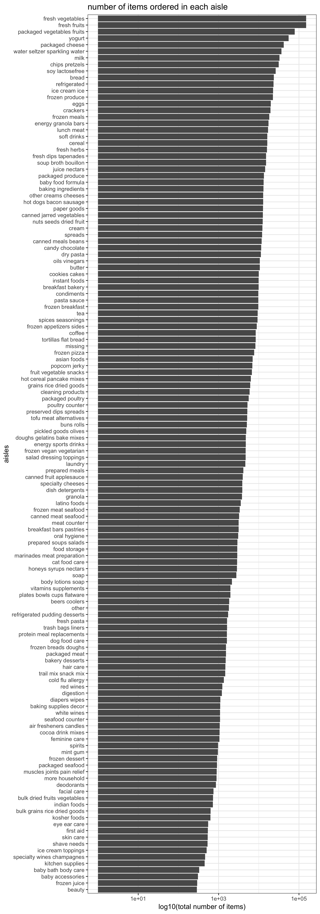

p8105\_hw3\_gw2383
================
Guojing Wu
2018/10/7

-   [Problem 1](#problem-1)
    -   [data cleaning](#data-cleaning)
    -   [some questions](#some-questions)
-   [Problem 2](#problem-2)
    -   [short description](#short-description)
    -   [some questions](#some-questions-1)
-   [Problem 3](#problem-3)
    -   [short description](#short-description-1)
    -   [some questions](#some-questions-2)

Problem 1
---------

### data cleaning

``` r
brfss_df =
  p8105.datasets::brfss_smart2010 %>%
  janitor::clean_names() %>% # cleaning
  rename(location_abbr = locationabbr, location_desc = locationdesc) %>% # format the variable name
  filter(topic == "Overall Health") %>% # focus on the “Overall Health” topic
  filter(response %in% c("Poor", "Fair", "Good", "Very good", "Excellent")) %>% # choose response
  arrange(response) # organize responses
```

### some questions

-   In 2002, CT, FL, NC states were observed at 7 locations

-   spaghetti plot

``` r
brfss_df %>%
  distinct(year, location_abbr, location_desc) %>%
  group_by(year, location_abbr) %>%
  summarise(n = n()) %>%
  ggplot(aes(x = year, y = n, group = location_abbr, color = location_abbr)) +
  geom_line() +
  labs(
    y = "number of observatons",
    title = " number of observations in each state from 2002 to 2010"
  ) +
  theme_bw()
```


-   a table of mean and standard deviation

``` r
brfss_df %>%
  filter(year %in% c(2002, 2006, 2010) & location_abbr == "NY" & response == "Excellent") %>%
  group_by(year) %>%
  summarise(mean_exc = mean(data_value),
            sd_exc = sd(data_value)) %>% 
   knitr::kable(digits = 1)
```

|  year|  mean\_exc|  sd\_exc|
|-----:|----------:|--------:|
|  2002|       24.0|      4.5|
|  2006|       22.5|      4.0|
|  2010|       22.7|      3.6|

-   a five-panel plot

``` r
brfss_df %>%
  group_by(year, location_abbr, response) %>%
  summarise(mean_prop = mean(data_value)) %>%
  ggplot(aes(x = year, y = mean_prop, group = location_abbr, color = location_abbr)) +
  geom_line() +
  labs(y = "average proportion") +
  facet_grid(response ~ ., scales = "free") + # ploting vertically and without the same axis scaling
  theme_bw()
```

    ## Warning: Removed 2 rows containing missing values (geom_path).


Problem 2
---------

``` r
insta_df = p8105.datasets::instacart %>% 
  janitor::clean_names()
```

### short description

There are 15 variables and 1384617 observations in this dataset. It contains details of every order: like `user id`: customer identifier, `order id`: order identifier, `product id`: product identifier, `product name`, `reordered`: whether it's reordered or not, when it was ordered (assume 0 was assigned to Sunday). Also, in the local store, there are 21 departments.

``` r
insta_df %>% select(user_id, order_id, product_id, product_name, reordered, order_dow) %>% head(10) %>% knitr::kable()
```

|  user\_id|  order\_id|  product\_id| product\_name                                 |  reordered|  order\_dow|
|---------:|----------:|------------:|:----------------------------------------------|----------:|-----------:|
|    112108|          1|        49302| Bulgarian Yogurt                              |          1|           4|
|    112108|          1|        11109| Organic 4% Milk Fat Whole Milk Cottage Cheese |          1|           4|
|    112108|          1|        10246| Organic Celery Hearts                         |          0|           4|
|    112108|          1|        49683| Cucumber Kirby                                |          0|           4|
|    112108|          1|        43633| Lightly Smoked Sardines in Olive Oil          |          1|           4|
|    112108|          1|        13176| Bag of Organic Bananas                        |          0|           4|
|    112108|          1|        47209| Organic Hass Avocado                          |          0|           4|
|    112108|          1|        22035| Organic Whole String Cheese                   |          1|           4|
|     79431|         36|        39612| Grated Pecorino Romano Cheese                 |          0|           6|
|     79431|         36|        19660| Spring Water                                  |          1|           6|

### some questions

-   There are 134 aisles in the store. And among them, "fresh vegetables" aisle is the most items ordered from.

-   a plot that shows the number of items ordered in each aisle

``` r
# a function for sorting the factors so that aisles will be listed in descending way
reorder_size <- function(x) {
  factor(x, levels = names(sort(table(x))))
}

insta_df %>% 
  select(aisle) %>% 
  ggplot(aes(x = reorder_size(aisle))) +
  geom_bar() +
  scale_y_log10() +
  labs(x = "aisles", 
       y = "log10(total number of items)", 
       title = "number of items ordered in each aisle") +
  coord_flip() # flipping it so that reader can see it clearly
```



-   the most popular item:

``` r
insta_df %>% 
  filter(aisle %in% c("baking ingredients", "dog food care", "packaged vegetables fruits")) %>% 
  group_by(aisle, product_name) %>% 
  summarise(item_num = n()) %>% 
  group_by(aisle) %>% 
  mutate(item_rank = min_rank(desc(item_num))) %>% # calculate the rank
  filter(item_rank == 1) %>% 
  knitr::kable(digits = 1)
```

| aisle                      | product\_name                                 |  item\_num|  item\_rank|
|:---------------------------|:----------------------------------------------|----------:|-----------:|
| baking ingredients         | Light Brown Sugar                             |        499|           1|
| dog food care              | Snack Sticks Chicken & Rice Recipe Dog Treats |         30|           1|
| packaged vegetables fruits | Organic Baby Spinach                          |       9784|           1|

-   a table showing the mean hour of the day

for the consecutive number in order\_dow, we assume 0 assign to Sunday, 1 assign to Monday and so on ...

``` r
insta_df %>% 
  filter(product_name %in% c("Pink Lady Apples", "Coffee Ice Cream")) %>% 
  select(product_name, order_dow, order_hour_of_day) %>% 
  group_by(product_name, order_dow) %>% 
  summarise(mean_hour = mean(order_hour_of_day)) %>% 
  spread(key = order_dow, value = mean_hour) %>% 
  rename(Sunday = "0", Monday = "1", Tuesday = "2", Wednesday = "3", Thursday = "4", Friday = "5", Saturday = "6") %>% # rename it to make it readable
  knitr::kable(digit = 1)
```

| product\_name    |  Sunday|  Monday|  Tuesday|  Wednesday|  Thursday|  Friday|  Saturday|
|:-----------------|-------:|-------:|--------:|----------:|---------:|-------:|---------:|
| Coffee Ice Cream |    13.8|    14.3|     15.4|       15.3|      15.2|    12.3|      13.8|
| Pink Lady Apples |    13.4|    11.4|     11.7|       14.2|      11.6|    12.8|      11.9|

Problem 3
---------

``` r
noaa_df = p8105.datasets::ny_noaa %>% 
  janitor::clean_names()
```

### short description

There are 7 variables and 2595176 observations in this dataset. It contains details of everyday weatherr: like `id`: Weather station ID, `date`: Date of observation, `prcp`: Precipitation (tenths of mm), `snow`: Snowfall (mm), `snwd`: Snow depth (mm), `tmax`: aximum temperature (tenths of degrees C), `tmin`: Minimum temperature (tenths of degrees C).

Also we noticed that there are many NAs in the dataset, below are the table of the proportion of NAs in each column

``` r
noaa_df %>% 
  summarise(id_na = sum(is.na(id))/length(id),
            date_na = sum(is.na(date))/length(date),
            prcp_na = sum(is.na(prcp))/length(prcp),
            snow_na = sum(is.na(snow))/length(snow),
            snwd_na = sum(is.na(snwd))/length(snwd),
            tmax_na = sum(is.na(tmax))/length(tmax),
            tmin_na = sum(is.na(tmin))/length(tmin)
            ) %>% 
  knitr::kable(digits = 3)
```

|  id\_na|  date\_na|  prcp\_na|  snow\_na|  snwd\_na|  tmax\_na|  tmin\_na|
|-------:|---------:|---------:|---------:|---------:|---------:|---------:|
|       0|         0|     0.056|     0.147|     0.228|     0.437|     0.437|

### some questions

-   data cleaning and create separate variables for year, month, and day

``` r
noaa_df = noaa_df %>% 
  separate(date, into = c("year", "month", "day"), sep = "-") %>% # separate the date
  mutate(prcp = as.numeric(prcp)/10, tmax = as.numeric(tmax)/10, tmin = as.numeric(tmin)/10) %>% # change the unit
  rename(prcp_in_mm = prcp, snow_in_mm = snow, snwd_in_mm = snwd, tmax_in_celsius = tmax, tmin_in_celsius = tmin)
```

Find the most commonly observed values for snowfall:

``` r
result_1 = noaa_df %>% 
  group_by(snow_in_mm) %>% 
  summarise(observe_num = n()) %>% 
  arrange(desc(observe_num)) %>% # decreasing order
  .[1,]
```

The value is 0, and it has been observed 2008508 times.

-   a two-panel plot showing the average max temperature in January and in July in each station across years

``` r
noaa_df %>% 
  filter(month %in% c("01", "06")) %>% # choose
  group_by(id, year, month) %>% # group by
  summarise(mean_tmax = mean(tmax_in_celsius, na.rm = T)) %>% # calculate mean
  filter(!is.na(mean_tmax)) %>% # remove NA
  ggplot(aes(x = year, y = mean_tmax, group = id, color = id)) +
  geom_line() +
  facet_grid(month ~ ., scales = "free") +
  theme(
    legend.position = "bottom", 
    axis.text.x = element_text(size = 5), 
    legend.text = element_text(size = 5)
    )
```


As we can see from the plot, it did follow some observable structure. The average temperature follows specific waving pattern: like in January 1994, the temperature in all stations reached their nadir, or in June 1999, the temperature in all stations reached their peak.

But we can also see some outliers: like in January 1982, (USC00301723, -13.4387097) is an outlier, or in June 2004, (USC00302454, 17.0066667) is an outlier too.

-   a two-panel plot showing tmax vs tmin for the full dataset

``` r
# first make a plot of mean tmax
tmax_plot = 
  noaa_df %>% 
  ggplot(aes(x = year, y = tmax_in_celsius)) +
  geom_violin(aes(fill = year), color = "blue", alpha = 0.5) +
  ylim(-60, 60) +
  stat_summary(fun.y = median, geom = "point", color = "blue", size = 2) +
  theme(legend.position = "none")

# then make a plot of mean tmin
tmin_plot = 
  noaa_df %>% 
  ggplot(aes(x = year, y = tmin_in_celsius)) +
  geom_violin(aes(fill = year), color = "blue", alpha = 0.5) +
  ylim(-60, 60) +
  stat_summary(fun.y = median, geom = "point", color = "blue", size = 2) +
  theme(legend.position = "none")

tmax_plot / tmin_plot
```

    ## Warning: Removed 1134358 rows containing non-finite values (stat_ydensity).

    ## Warning: Removed 1134358 rows containing non-finite values (stat_summary).

    ## Warning: Removed 1134420 rows containing non-finite values (stat_ydensity).

    ## Warning: Removed 1134420 rows containing non-finite values (stat_summary).


a plot showing the distribution of snowfall values greater than 0 and less than 100 separately by year

``` r
noaa_df %>% 
  filter(snow_in_mm > 0 & snow_in_mm < 100) %>% 
  ggplot(aes(x = year, y = snow_in_mm)) +
  geom_violin(aes(fill = year), color = "blue", alpha = 0.5) +
  stat_summary(fun.y = median, geom = "point", color = "blue", size = 2) +
  theme(legend.position = "none")
```


